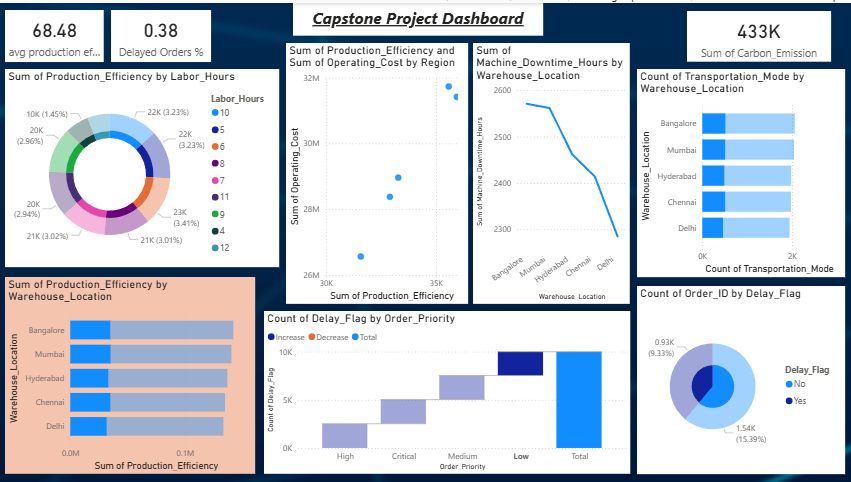

# 📊 Logistics Performance Analysis (Excel)

## 📊 Overview
This project analyzes logistics and supply chain data using Excel to identify performance trends, cost patterns, and operational insights.

## 🎯 Objectives
- Analyze delivery performance 🚚  
- Evaluate operational costs 💰  
- Identify inefficiencies 📉  

## 📊 Features
- KPI metrics (Cost, Profit, Orders)  
- Trend analysis  
- Category & region insights  

## 🛠 Tools Used
- Microsoft Excel  
- Pivot Tables  
- Data Analysis  

## 🖼 Dashboard Preview

## 📂 Project File
🔽 [Download Excel File](logistics-analysis.xlsx)

## 📈 Key Insights
- Identified high-cost regions  
- Found patterns in delivery delays  
- Improved understanding of operations  

## 👩‍💻 Author

Shambhavi Tripathi

https://www.linkedin.com/in/shambhavi-tripathi-94bb9937a

https://github.com/shambhavi04august-hub

Logistics Professional 🚚 | Tech Enthusiast 💻 | Data-Driven 📊
